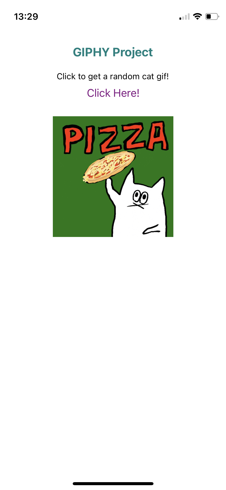

# Cat GIFs Galore

## Description
_Duration: 4.5 hours_

See a random cat GIF whenever you like when you click the 'Click Here!' button.

Built using Expo Go on an iOS device.

## Screen Shots

### Prerequisites

- [Expo Go](https://expo.dev/) account with Expo Go app downloaded on your mobile device.
- [GIPHY API](https://developers.giphy.com/) key

### Installation

- Sign into your Expo Go account on your mobile device.
- Open your editor of choice and run `npm install`.
- In the root of the project, create a `.env` file. 
- Add `.env` file name to `.gitignore` file.
- In the `.env` file, set REACT_APP_GIPHY_URL=https://api.giphy.com/v1/gifs/random?api_key=YOUR_KEY_HERE&tag=cats&rating=g. Replace 'YOUR_KEY_HERE' with your GIPHY API key.
- Run `npm start` in your terminal. 
- Scan the QR code with your mobile device and open app in your Expo Go account.
- Enjoy cat GIFs!

## Built With

- React Native
- Expo Go
- JavaScript
- React Native dotenv
- GIPHY API
